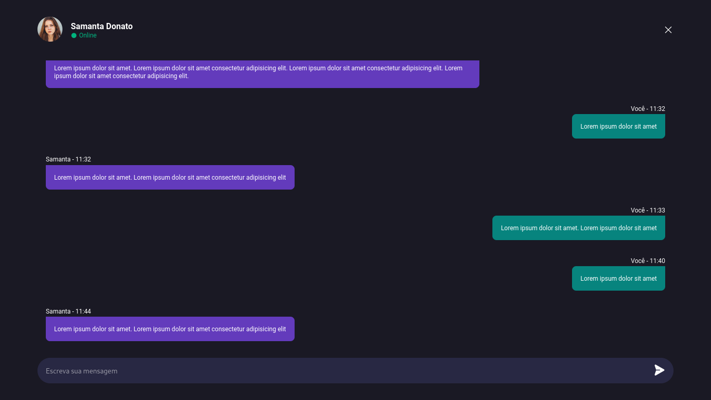

# Desafio 01 - Player de músicas

  

 

# Desafio 02 - Card de produto

  

# Desafio 03 - Botões e Cusores

  

# Desafio 04 - Chat

  

# Desafio 05 - Calculadora

  

# Desafio 06 - Cartão de embarque

  

