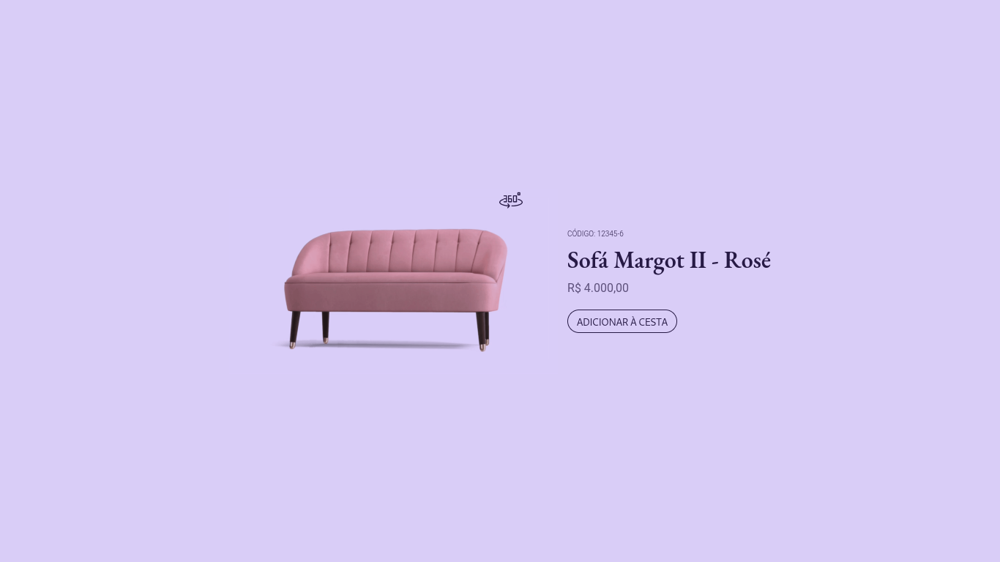

<h1 align="center">Card de produto</h1>

<h3 align="center">2º Desafio do programa bora codar, promovido pela Rocketseat para ensinar tecnologias WEB.</h3>

  <a href="#-tecnologias">Tecnologias</a>&nbsp;&nbsp;&nbsp;|&nbsp;&nbsp;&nbsp;
  <a href="#-projeto">Projeto</a>&nbsp;&nbsp;&nbsp;|&nbsp;&nbsp;&nbsp;
  <a href="#-layout">Layout</a>&nbsp;&nbsp;&nbsp;|&nbsp;&nbsp;&nbsp;
  <a href="#-memo-licença">Licença</a>

 

  

## 🚀 Tecnologias

Esse projeto foi desenvolvido com as seguintes tecnologias:

  

  

  

  

## 🚧 Projeto

Este projeto foi desenvolvido para cumprir o 2º desafio do #boracodar, promovido pela [Rocket Seat](https://www.rocketseat.com.br).
Confira esse e outros desafios [Bora codar](https://www.rocketseat.com.br/boracodar)

## 🏷️ Layout

Você pode visualizar o [layout do projeto no Figma](https://www.figma.com/community/file/1195050984449538256)

## 📝 Licença

  

---

Feito com 🤍 por: Joiaribe
