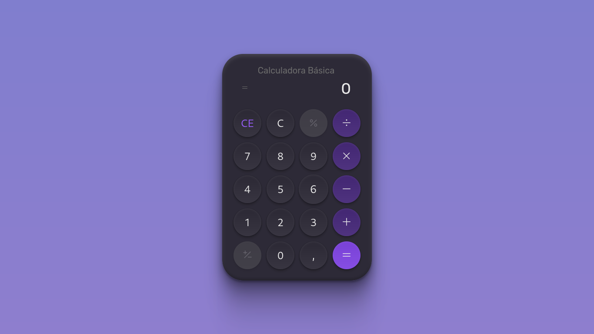

## Boas vindas
Olá, seja bem vindo ao desafio 5 do [#boraCodar](https://www.rocketseat.com.br/boracodar)

---

## Sobre o desafio
Neste desafio foi construído uma **calculadora** utilizando **HTML**, **CSS** e **Javascript**. Esta calculadora está habilidata para resolver operações matemáticas simples, não foi implementada a função para cálculo de porcentagem.

---

## Tecnologias utilizadas

---

## Layout

Você pode visualizar o [layout do projeto no Figma](https://www.figma.com/community/file/1202607074523509182)

---

## Licença

---

Obrigado por visitar e até o próximo desafio! 🚀🚀🚀
