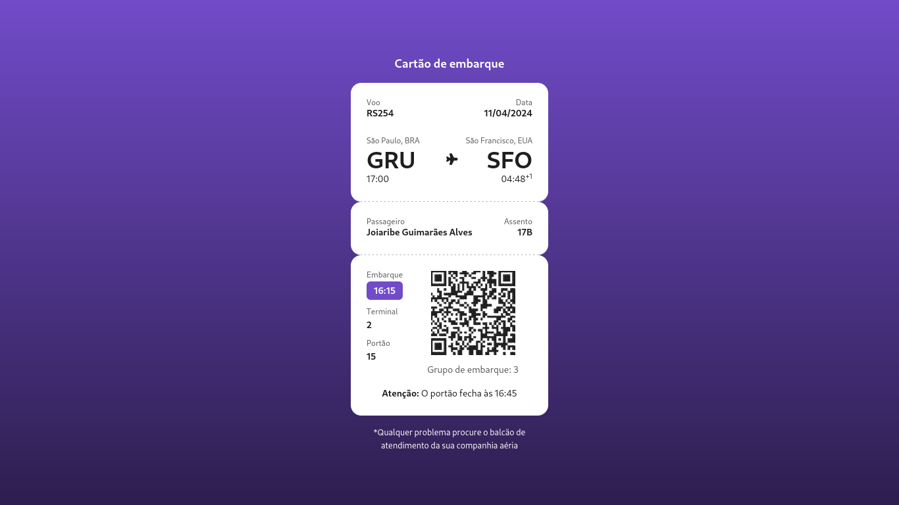

## Boas vindas

Olá, seja bem vindo ao desafio 6 do [#boraCodar](https://www.rocketseat.com.br/boracodar)

---

## Sobre o desafio

Neste desafio foi construído um **cartão de embarque** utilizando **HTML**, **Tailwind CSS** e **Javascript**. A principal dificuldade foi montar o layout, porém com o uso do Tailwindcss o trabalho foi facilitado. O QRCode é gerado pelo JavaScript. Para isso utilizei uma [biblioteca externa](https://github.com/davidshimjs/qrcodejs/tree/master). 

---

## Tecnologias utilizadas

---

## Layout

Você pode visualizar o [layout do projeto no Figma](https://www.figma.com/community/file/1205146101173113980)

---

## Licença

---

Obrigado por visitar e até o próximo desafio! 🚀🚀🚀
