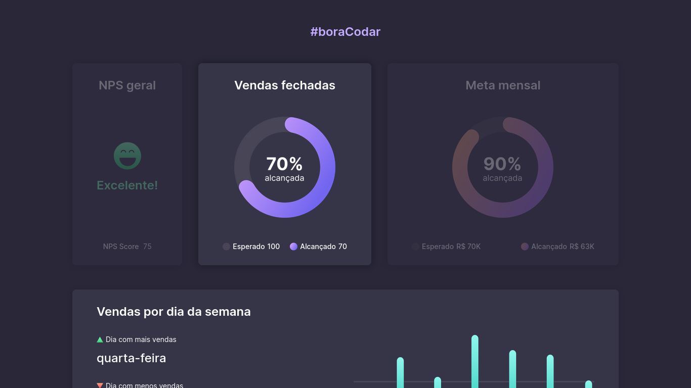
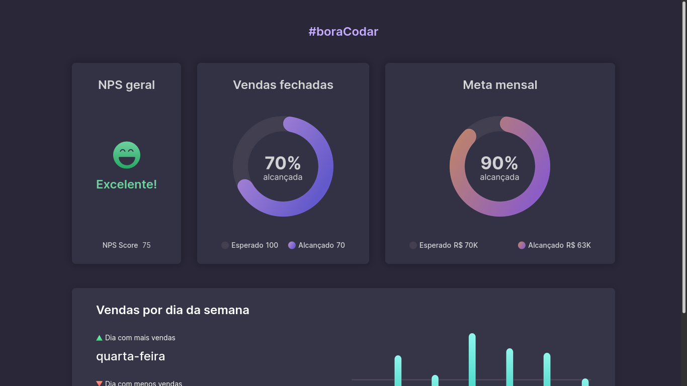

## Boas vindas
Olá, seja bem vindo ao desafio 8 do [#boraCodar](https://www.rocketseat.com.br/boracodar)

---

## Sobre o desafio
Neste desafio foi construído uma tela de *dashboard* para mostrar a satisfação dos clientes com a empresa (nps), e também para mostrar, através de gráficos, as vendas realizadas e a porcentagem da meta total de vendas alcançada.

---

## Tecnologias utilizadas

Obrigado por visitar e até o próximo desafio! 🚀🚀🚀
